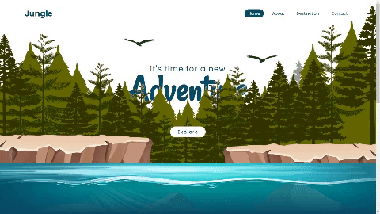

# 
Parallax Scrolling Website

The goal of this project is to develop a simple parallax scrolling effect with CSS & vanilla Javascript

## 🛠️ Technologies

<ul>
  <li><a href="https://git-scm.com/">Git</a></li>
  <li><a href="https://www.w3schools.com/css/">CSS3</a></li>
  <li><a href="https://www.w3schools.com/html/">HTML5</a></li>
  <li><a href="https://www.javascript.com/">JavaScript</a></li>
</ul>

## Image Source

<a href="https://www.freepik.com/free-vector/natural-environment-lanscape-scene_5837826.htm">Tree vector created by brgfx - www.freepik.com</a>

## Autor

Bruno Silva Santana - <ibrunoss@outlook.com> - <https://github.com/ibrunoss>
